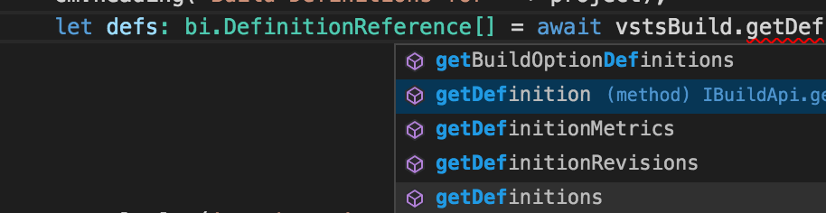

# Visual Studio Team Services Client for Node.js

Integrate with Visual Studio Team Services from your Node.js apps.

## Get started

### Samples

See [samples](./samples) for complete coding examples

### Install the library
```
npm install vso-node-api --save
```

### Typings

Typings (.d.ts) are now distributed with the api, so intellisense and compile support just works from `tsc` and [vscode]()  

  

### Create a connection
```javascript
let vsts = require('vso-node-api');

// your collection url
let collectionUrl = "https://fabrikam.visualstudio.com/defaultcollection";

// ideally from config
let token: string = "cbdeb34vzyuk5l4gxc4qfczn3lko3avfkfqyb47etahq6axpcqha"; 

let authHandler = vsts.getPersonalAccessTokenHandler(token); 
let connect = new vsts.WebApi(collectionUrl, authHandler);    
```

### Get an instance of a client

```javascript
import * as ba from 'vso-node-api/BuildApi';

let vstsBuild: ba.IBuildApi = connection.getBuildApi();
```

#### Available clients

These clients are available in the new 6.x preview API (`npm install vso-node-api@preview`)

* Accounts
* Build
* Chat
* Contributions
* Core
* Dashboard
* DelegatedAuthorization
* ExtensionManagement
* FeatureManagement
* FileContainer
* Gallery
* Git
* Identities
* Licensing
* Locations
* Notification
* Organization
* Policy
* Profile
* Release
* SecurityRoles
* ServiceHooks
* TaskAgent
* Task
* Test
* Tfvc
* Token
* Work
* WorkItemTracking

### Use the client
 
Coding is easy using linear coding with async/await in typescript

```javascript
import * as bi from 'vso-node-api/interfaces/BuildInterfaces';

async function run() {
    let project: string = 'myProject';
    let defs: bi.DefinitionReference[] = await vstsBuild.getDefinitions(project);

    defs.forEach((defRef: bi.DefinitionReference) => {
        console.log(defRef.name + ' (' + defRef.id + ')');
    });    
}

run();
```

## APIs

To see what APIs are available, see the appropriate client interface. For example, [GitApi.ts](https://github.com/Microsoft/vsts-node-api/blob/master/api/GitApi.ts)

## Running Samples

Pre-reqs: [Node >= 4.4.7 LTS](https://nodejs.org) and [typescript (tsc) >= 1.8](https://www.npmjs.com/package/typescript)  

Run `npm install` first

Set environment variables using set or export:

```bash
API_URL=https://fabrikam.visualstudio.com/defaultcollection  

// use your token
API_TOKEN=cbdeb34vzyuk5l4gxc4qfczn3lko3avfkfqyb47etahq6axpcqha  

API_PROJECT=myProject  
```

Run samples:  

```bash
$ npm run samples
```

Run a specific sample:

```bash
$ npm run samples -- http
```

## Contributing

To contribute to this repository, see the [contribution guide](./CONTRIBUTING.md)

## Code of Conduct

This project has adopted the [Microsoft Open Source Code of Conduct](https://opensource.microsoft.com/codeofconduct/). For more information see the [Code of Conduct FAQ](https://opensource.microsoft.com/codeofconduct/faq/) or contact [opencode@microsoft.com](mailto:opencode@microsoft.com) with any additional questions or comments.
